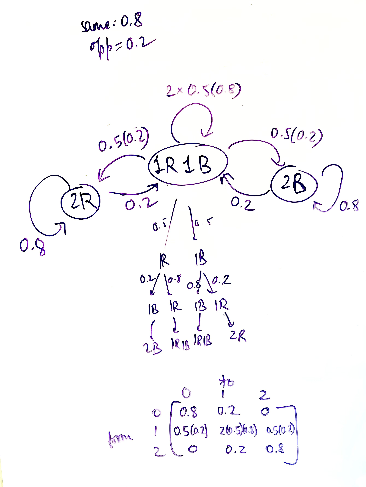

Submit your completed lab to Moodle as a pdf or html document.

The objective of these exercises is to explore large-time behavior and equilibria (invariant probability distributions) of finite-state Markov chains. Feel free to discuss problems with each other during lab in addition to asking me questions.

To take powers of matrices in R, remember to load the matrix exponentiation package expm. If you haven't installed it yet, do _install.packages('expm')_.

```{r results='hide', message=FALSE, warning=FALSE}
library(expm)
```

### Warm-up problem

Suppose an urn contains 2 balls, where balls can be either blue or red. Initially, both balls are red. At each stage, one ball is removed at random and replaced by a new ball, which with probability 0.8 is the same color as the removed ball and with probability 0.2 is the opposite color. 

1. Define $X_n$ to be the number of red balls in the urn after the $n$th selection. What are the possible states? What is the transition matrix $\mathbf{P}$ for the resulting Markov chain?


```{r}
# X_n is number of red balls after nth selection
# The possible states are 0R, 1R, 2R
# transition matrix
P <- matrix(0,3,3)

P[1,] <- c(.8,.2,0)
P[2,] <- c(.1,.8,.1)
P[3,] <- c(0,.2,.8)
rownames(P) <- c("0","1","2")
colnames(P) <- c("0","1","2")
P
```

2. What is the probability that $X_1=2$, given that $X_0=2$?

Sol: 0.8

3. What is the probability that $X_5=2$, given that $X_0=2$? (Use a power of $\mathbf{P}$ to compute this.)

Sol: The answer is element at (2,2) of the below matrix: 0.43328
```{r}
P %^% 5
```

4. What is the probability in the long run that the chain is in state 2? Solve in two ways: (a) raise  $\mathbf{P}$ to a large power; (b) compute the left eigenvectors of $\mathbf{P}$ and find the one corresponding to eigenvalue 1.

```{r}
###### part (a) #######
P %^% 100
print("The Probability is: 0.25")

###### part (b) #######
# find eigenvectors
r <- eigen(t(P)) # t is transpose, use if treating vectors as rows
V <- r$vectors
lambda <- r$values
V # left eigenvectors
V[,1]/sum(V[,1]) # invariant vector (eigenvector for lambda=1)
Q <- solve(V) # right eigenvectors
Q[1,]/Q[1,1] # lambda=1 has right eigenvector of all 1s
t(V %*% diag(lambda) %*% solve(V))

pibar <- V[,1]/sum(V[,1]) # invariant vector (eigenvector for lambda=1)
pibar

# We can see that pibar matches the rows of the matrix to a large power as in part (a)

```

### Bernoulli-Laplace model of diffusion

Consider two urns $A$ and $B$, each of which contains $m$ balls; $b$ of the $2m$ total balls are black and the remaining $2m-b$ are white. At each stage, one ball is randomly chosen from each urn and put in the other urn (done simultaneously, so balls are being swapped between urns). Define $X_n$ to be the number of black balls in urn $A$ after the $n$th swap. Observe that $X_n=i$ implies $A$ contains $i$ black balls and $m-i$ white balls, while $B$ contains $b-i$ black balls and $m-(b-i)$ white balls. The resulting Markov chain is a probabilistic model of diffusion of two fluids.

Let $m=4$ and $b=4$ for purposes of this lab (to keep calculations manageable). Assume urn $A$ initially contains 4 white balls and $B$ contains 4 black balls.

5. What are the possible states? What is the transition matrix $\mathbf{P}$ for the resulting Markov chain? What kind of boundaries does this chain have?

Sol: The following is the resulting transition matrix. The boundaries are the cases when number of white balls in urn A is 0 and 4 respectively.
```{r}
P <- matrix(0,5,5) # 5x5 matrix of zeros 
P[1,2]<-1
P[5,4]<-1 # enter the correct values for P
P[2,1:3]<-c(1/16,6/16,9/16)
P[3,2:4]<-c(4/16,8/16,4/16)
P[4,3:5]<-c(9/16,6/16,1/16)

# updating the nomenclature
# row represents number of White balls in A intially
# column represents number of White balls in A finally
rownames(P) <- c("0","1","2","3","4")
colnames(P) <- c("0","1","2","3","4")
P
```

6. What is the probability that $X_2=0$, given that $X_0=0$? 

Sol: The value at (0,0) in P^2: 0.0625
```{r}
P %^% 2
```
7. What is the probability that $X_3=0$, given that $X_0=0$?

Sol: The value at (0,0) in P^3: 0.0234375
```{r}
P %^% 3
```
8. What is the probability that $X_6=0$, given that $X_0=0$?

Sol: The value at (0,0) in P^6: 0.01589966
```{r}
P %^% 6
```
9. Let $\alpha$ be the initial probability distribution corresponding to $X_0=0$, and calculate $\alpha\mathbf{P}^n$, the probability distribution for $X_n$. As $n$ increases, what is $\alpha\mathbf{P}^n$ converging to?

Sol: It seems to converge to [0.01428571,0.2285714,0.5142857,0.2285714,0.01428571]

```{r}
alpha<-c(1,0,0,0,0)
n<-100000
alpha %*% (P %^% n)
```

10. Find the eigenvalues of $\mathbf{P}$.

```{r}
r <- eigen(t(P))
r$values
```

11. Find the left eigenvector of $\mathbf{P}$ corresponding to eigenvalue 1, and compare to the vector you found in Exercise 9.

Sol: They match perfectly!
```{r eval = FALSE}
V <- r$vectors
lambda <- r$values
V # left eigenvectors
V[,1]/sum(V[,1]) # invariant vector (eigenvector for lambda=1)
Q <- solve(V) # right eigenvectors
Q[1,]/Q[1,1] # lambda=1 has right eigenvector of all 1s
t(V %*% diag(lambda) %*% solve(V))

pibar <- V[,1]/sum(V[,1]) # invariant vector (eigenvector for lambda=1)
```

```{r}
pibar
P %^% 100        
# pibar matches rows of large power of matrix

```
