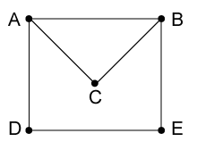

Submit your completed lab to Moodle as a pdf or html document.

The objective of these exercises is to study a random walk on a small graph through a combination of simulations and analysis using R.

#### Problem set-up

Consider the simple random walk on the graph shown below. We define a Markov chain which moves from vertex to vertex by randomly following an edge to an adjacent vertex. For example,

$$\mathbb{P}\{X_{n+1}=A\,|\ X_n=D\}=1/2$$
$$\mathbb{P}\{X_{n+1}=C\,|\ X_n=A\}=1/3$$
$$\mathbb{P}\{X_{n+1}=B\,|\ X_n=D\}=0$$



Determine the transition matrix $\mathbf{P}$ for this Markov chain with states $\{A,B,C,D,E\}$.

```{r}
library(expm)
P <- matrix(0,5,5)
P[1,] <- c(0,1/3,1/3,1/3,0)
P[2,] <- c(1/3,0,1/3,0,1/3)
P[3,] <- c(1/2,1/2,0,0,0)
P[4,] <- c(1/2,0,0,0,1/2)
P[5,] <- c(0,1/2,0,1/2,0)
rownames(P)<-c('A','B','C','D','E')
colnames(P)<-c('A','B','C','D','E')
P
```

#### Analysis of the Markov chain

1. Calculate the invariant probability vector $\bar{\pi}$. In the long run, about what fraction of the time is spent at vertex $A$?

Sol: 0.25
```{r}
P %^% 100
```

```{r}
r <- eigen(t(P))
V<-r$vectors
pibar<-V[,1]/sum(V[,1])
pibar

ans1 <- pibar[1]

ans1
```
2. Suppose the random walk begins at vertex $A$. What is the expected number of steps until the walk returns to $A$?
```{r}
ans2 <- 1/pibar[1]
ans2
```
We can use simulations to generate the distribution of return times, as the expected value doesn't tell the full story. First define a function that can randomly step from vertex to vertex: 

```{r}
takestep <- function(x) {
  switch(x,
         sample(c(2,3,4),1), #A
         sample(c(1,3,5),1), #B
         sample(c(1,2),1),   #C
         sample(c(1,5),1),   #D
         sample(c(2,4),1))   #E
}
```

Next define a function that finds the return time to a desired vertex for each simulation:

```{r}
waitingtime <- function(vertex) {
  x <- vertex
  for (j in 1:10000) {
    x <- takestep(x)
    ifelse(x==vertex, return(j),-1) # takes steps until hits vertex again
    } }
```
  
Run many simulations and plot a histogram of the return times:
  
```{r}
nsims <- 100000
sims <- matrix(0,nsims)
for (k in 1:nsims)  sims[k] <- waitingtime(1) # vertex A
hist(sims,(min(sims)-1):(max(sims)+1),freq=FALSE,
     xlab="Number of steps",xlim=c(0,20),
     main=paste("Mean first return time is",mean(sims)))
```

3. Suppose the random walk begins at vertex $C$. What is the expected number of steps until the walker reaches $A$? Hint: Make $A$ an absorbing state, then calculate matrices $\mathbf{Q}$ and $\mathbf{M}$.
```{r}
Q<-P[2:5,2:5]
Q
M<-solve(diag(4)-Q)
M
ans3<-sum(M[2,])
ans3

```
4. Suppose the random walk begins at vertex $C$. What is the expected number of visits to $B$ before the walker reaches $A$? 
```{r}
M[2,1]
```
5. Suppose the random walk begins at vertex $B$. What is the probability that the walker reaches $A$ before $C$?
```{r}
P[1,]<-c(1,0,0,0,0)
P[3,]<-c(0,0,1,0,0)
P
P_ac_absorbing_asymptotic<-P %^% 1000
P_ac_absorbing_asymptotic
P_ac_absorbing_asymptotic[2,1]
```
