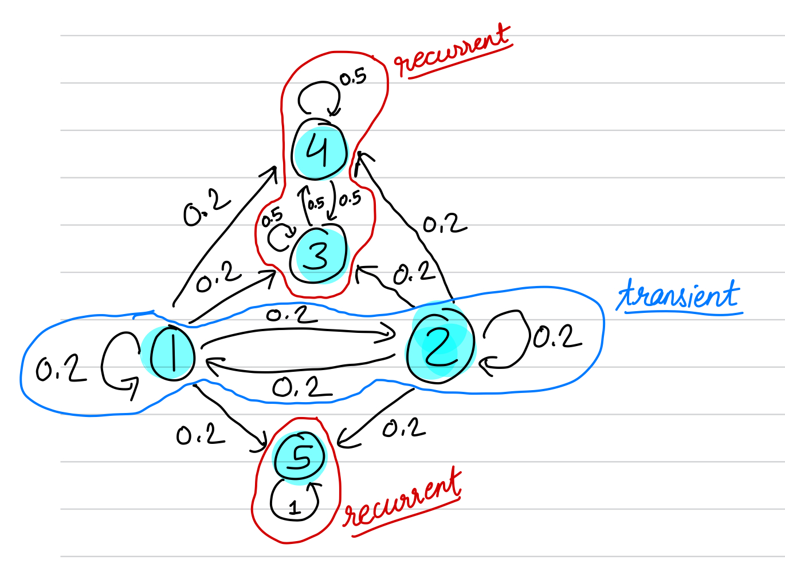
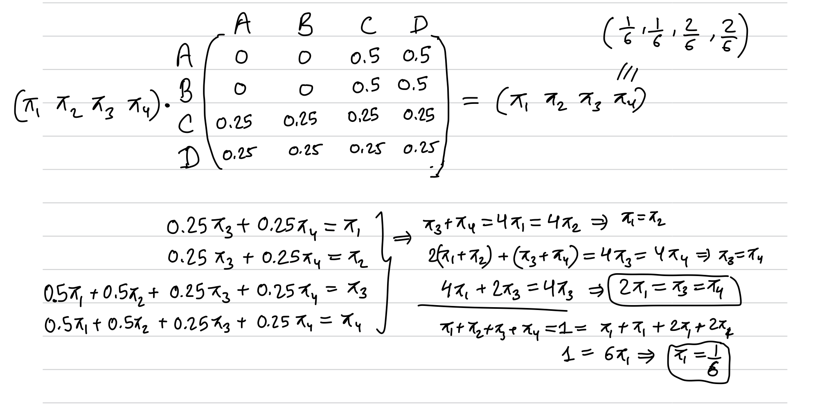
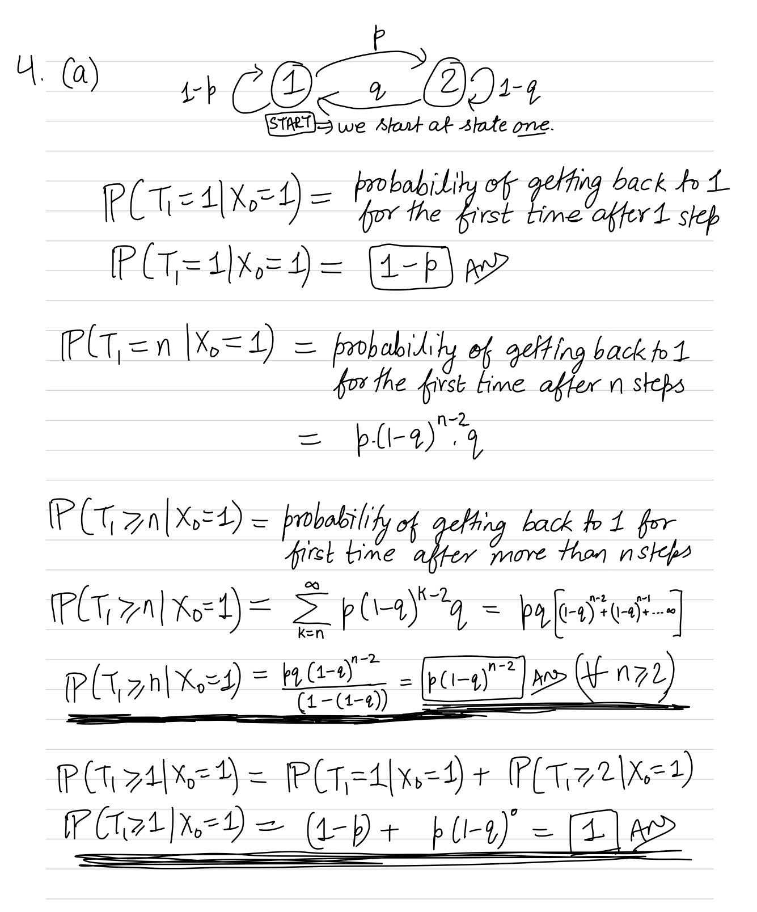
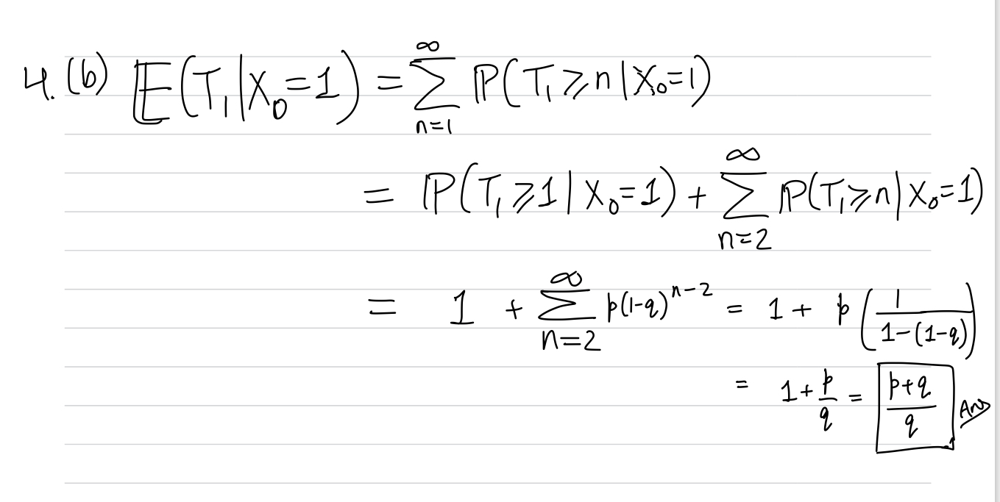
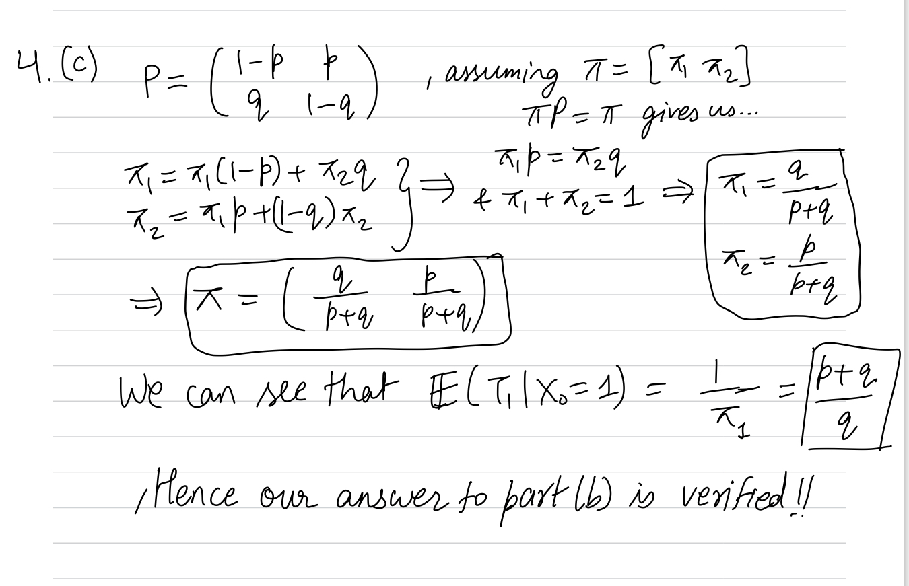

Please answer each problem as clearly and completely as you can.  Do not discuss these problems with other students, or anyone else but me. You may use your textbook, lecture notes, class materials (including those posted on the Math 365 website), and homework, but do not use other books, the internet, or any materials other than those directly associated with the course.  Please do feel free to ask me questions, either via email or meeting with me. Show all work to demonstrate that you understand your answer. You may use R for any computations.

Exam is due **Thursday March 10**, submitted to Gradescope. Late submissions will be penalized by 10 points per day unless you obtain an extension.

## Problem 1 (20pt) 

Suppose a Markov chain with state space $S=\{1,2,3,4,5\}$ has the following transition matrix:

```{r}
P<-matrix(0,5,5)
P[1:2,]<-.2
P[3:4,3:4]<-.5
P[5,5]<-1
P
```

(a) Find the communication classes and label each as recurrent or transient.



Ans: 

{1,2} is a transient class. 

{3,4} is a recurrent class.

{5} is a recurrent class.


(b) Find the probability that the chain eventually ends up in the communication class containing state 4, given that the chain starts in state 2. Do this calculation in two ways: (1) use a large power of P to estimate the probability; (2) use a theoretical result for a precise probability.

```{r (b) estimated result}
library(expm)
#### Method 1 ####
P_long <- P %^% 1000
P_long[2,3] + P_long[2,4]

```

```{r theoretical result}
# Making 3,4,5 absorbing states
Q<-P[c(1,2),c(1,2)]
Q
R <- P[c(1,2),c(3,4,5)]

M<-solve(diag(2)-Q)
M
A <- M %*% R
prob_landing_3_or_4_when_start_at_2 <- A[2,1] + A[2,2]
prob_landing_3_or_4_when_start_at_2
```


## Problem 2 (15pt)  

Suppose you have only 4 songs in a playlist, and you set it to shuffle mode so that it randomly chooses one of the 4 songs to play after the previous song finishes (randomly chosen with replacement, so that it's possible for a song to be played more than one time in a row). Let $X_n$ be the number of distinct songs that have been played after the $n$th play. (So if it plays song 1 then song 2 then song 1, that is 2 distinct songs.)

(a) Show that $X_0, X_1, \dots$ satisfies the properties of a Markov chain and state the transition matrix $\mathbf{P}$.

Ans: The properties of a Markov Chain is satisfied because the rows sum up to 1 and the random variables are independent. The transition matrix can be found below...

```{r}
# If we consider the states to be 0, 1, 2, 3 or 4 number of distinct songs played in the state space
P<-matrix(0,5,5)
P[1,]<-c(0,1,0,0,0)
P[2,]<-c(0,1/4,3/4,0,0)
P[3,]<-c(0,0,1/4,3/4,0)
P[4,]<-c(0,0,0,1/4,3/4)
P[5,]<-c(0,0,0,0,1)
P
```

(b) Find the probability that all four songs have been heard after six plays.

Ans: $P(X_6 = 4 | X_0 = 0) = (P_{new}^{6})_{04} = 0.8964844$

```{r}
Pans <- P %^% 6
Pans[1,5]
```

## Problem 3 (25pt) 

Suppose an irreducible Markov chain with state space $S=\{A,B,C,D\}$ has the following transition matrix:

```{r}
P<-matrix(0,4,4)
rownames(P)<-c('A','B','C','D')
colnames(P)<-c('A','B','C','D')
P[1:2,3:4]<-.5
P[3:4,]<-.25
P
```

For full credit, answer the following questions using precise formulas to do the computations, rather than large powers of $P$ or simulations. (You are welcome to check your answers using the alternate methods.)

(a) Find the stationary probability vector $\bar{\pi}$.


Ans: The stationary probability vector is $(\frac{1}{6},\frac{1}{6},\frac{1}{3},\frac{1}{3})$

(b) Suppose the random walk begins at state $A$. What is the expected number of steps until the walk returns to state $A$?

Ans: $E(A) = \frac{1}{1/6} = 6$

(c) What is the probability of hitting state $D$ before hitting state $A$ if the chain starts at state $B$?

Ans: 0.8

```{r}
# Lets make both A and D absorbing 
Q<-P[2:3,2:3]
Q
R <- P[2:3,c(1,4)]
R
M<-solve(diag(2)-Q)
M
A <- M %*% R
A
A[1,2]
```

(d) Suppose the chain begins at state $C$. What is the expected number of steps until the walker reaches state $A$?

Ans: 5 steps

```{r}
Q<-P[2:4,2:4]
Q
M<-solve(diag(3)-Q)
M
ansd<-sum(M[2,])
ansd
```

(e) Suppose the chain begins at state $C$. What is the expected number of visits to state $D$ before the walker reaches state $A$?

Ans: 1.5 visits

```{r}
# Lets make both A and D absorbing 
Q<-P[2:4,2:4]
Q

M<-solve(diag(3)-Q)
M
anse <- M[2,3]
anse

```
## Problem 4 (20pt) 

Consider the following transition matrix for a Markov chain with state space $S=\{1,2\}$, where $0<p<1$ and $0<q<1$:

$\mathbf{P}=\begin{pmatrix}
1-p & p \\
q & 1-q
\end{pmatrix}$

Let $T_1$ be the number of steps until the state is 1 again, given that the chain starts at state 1.

(a) Calculate $\mathbb{P}(T_1\ge n | X_0=1)$ for $n\ge 2$. What is this probability when $n=1$?


Ans: When n=1, the probability expression reduces to 1.

(b) Use the result of part (a) to directly compute $\mathbb{E}(T_1 | X_0=1)=\sum_{n=1}^\infty{\mathbb{P}(T_1\ge n | X_0=1)}$.

 

(c) Calculate the stationary vector $\bar{\pi}$ by hand and use it to verify your answer in part (b).



## Problem 5 (20pt)  

In a sequence of fair coin flips, how many flips on average are needed to first see the pattern H-H-T-H? Set up a Markov chain and use it to calculate the desired value. Hint: consider only the usable part of the current sequence of flips (states can be patterns, so long as the Markov property is still satisfied) and what can happen with the next flip.

```{r}
# S = {null,(1),(11),(110),(1101)}
# A is null state
# B is (1) state
# C is (11) state
# D is (110) state
# E is (1101) state

P<-matrix(0,5,5)
P[1,]<-c(1/2,1/2,0,0,0)
P[2,]<-c(1/2,0,1/2,0,0)
P[3,]<-c(0,0,1/2,1/2,0)
P[4,]<-c(1/2,0,0,0,1/2)
P[5,]<-c(0,0,0,0,1)
rownames(P)<-c('A','B','C','D','E')
colnames(P)<-c('A','B','C','D','E')
P

# Finding expected number of steps to reach E given that we start the walk from A 
Q<-P[1:4,1:4]
Q
M<-solve(diag(4)-Q)
M
ans<-sum(M[1,])
ans
```