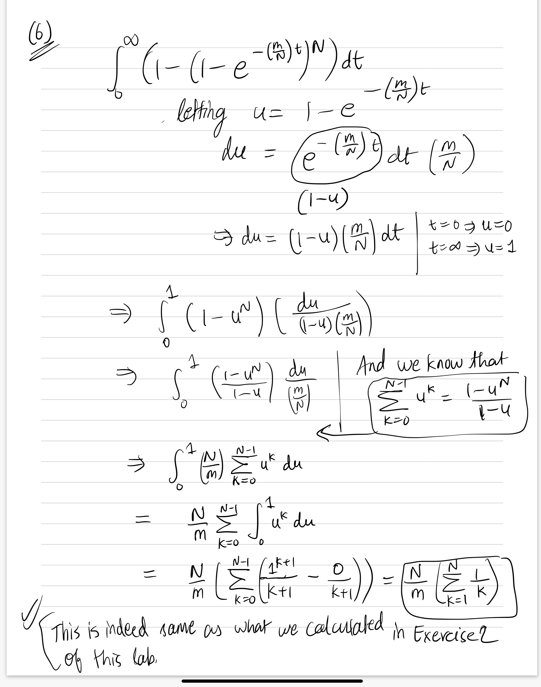

Coupon Collector's Problem

The objective of this lab is to study a famous problem in probability, the coupon collector's problem, and its connection to Poisson processes.

Submit the pdf knit from your completed lab to Gradescope.

#### Coupon Collector's Problem: Geometric Distribution Approach

A young baseball fan wants to collect a complete set of 262 baseball cards. The baseball cards are available in a completely random fashion, one per package of chewing gum, which the fan buys twice a day. How long on average will it take the fan to get a complete set?

More generally, we can ask how many coupons do we expect to buy before obtaining a complete collection of $N$ distinct coupons? For example, if the set of coupons for $N=4$ is represented by $\{a,b,c,d\}$, then a possible sequence of coupons bought on each day could be $a, a, d, b, d, a, d, b, c,$
so that we had to buy 9 coupons to obtain a complete set of the 4 distinct coupons.

Let $X$ be the number of coupons bought in order to collect all $N$ distinct coupons, and let $X_k$ be how many more coupons we bought to obtain a new coupon once our collection contains $k-1$ distinct coupons (the total number of coupons bought may get quite large, with many repeats of the same coupons). Clearly $X_1=1$. On each draw, the probability of collecting a new coupon, given that we already have $k-1$ different coupons, is $p_k=\frac{N-(k-1)}{N}$. That is, $X_k$ follows a geometric distribution and 
$$\mathbb{E}(X_k)=\frac{1}{p_k}=\frac{N}{N-k+1}.$$ 
Note that this means when we've collected $N-1$ different coupons, we expect to still have to buy $N$ more coupons before getting that last coupon needed to complete the full collection! The total expected number of coupons we must buy to complete the collection is 
$$\mathbb{E}(X)=\mathbb{E}(X_1)+\cdots+\mathbb{E}(X_N)=1+\frac{N}{N-1}+\cdots+\frac{N}{2}+N=N\sum_{n=1}^N{\frac{1}{n}}.$$

(1) According to this analysis, how many packages of gum should the fan expect to buy to complete her collection of 262 distinct baseball cards? How many days will this take on average?

Ans: 262(1/1 + 1/2 + 1/3 + ... + 1/262) = 1610.63644612 packages and 805.21822306 days.

(2) Modify the equation above to calculate the expected number of days to collect a full set, given that the collector buys $m$ coupons per day.

Ans: 1610.63644612/m

(3) Run simulations of the coupon collector problem to generate the distribution of the random variable $X$, using the code below. Compare the sample mean from the simulation with the theoretical mean.

```{r} 
#coupon collector simulation
nbought <- function(N) {
  coupons <- matrix(0,1,N) # initially have no coupons
  for (k in 1:100000) { # collect until complete collection
    x <- sample.int(N, 1, replace = TRUE)
    coupons[x]  <- 1 # mark that coupon type as collected
    ifelse(sum(coupons)==N,return(k),-1)
    } 
  }
N <- 7 # set to desired number of different coupons
y <- sapply(matrix(N,10000,1),nbought)
hist(y,main=paste("Coupon collector, mean=",round(mean(y),1)), breaks=30, freq=F, 
     xlab=paste("Number bought to complete collection of",N,"coupons"))

N*sum(1/(1:N)) # theoretical value for expected # of coupons bought before collecting all N
```

#### Coupon Collector's Problem: Poisson Process Approach

Now suppose there are $N$ distinct coupons and we buy at a rate of $m$ coupons/day (one at a time, chosen randomly). Let $T$ be the waiting time for obtaining a complete set of coupons. We can model waiting for a particular coupon type to be collected as a Poisson process with rate parameter $\lambda=m/N$, so we have $N$ independent Poisson processes to model the waiting time for collecting the $N$ different coupons. 

(4) What is the probability that we have to wait no longer than $t$ days to collect a particular coupon?

Ans: $1 - e^{-(m/N)*t}$

(5) Given that each coupon process is independent of the others, what is $F(t)=\mathbb{P}\{T\le t\}$?

Ans: $(1 - e^{-(m/N)*t})^N$

(6) We can calculate the expected value of $T$ by integrating $t$ times the density function $f(t)=F'(t)$:
$$\mathbb{E}(T)=\int_0^\infty{t f(t)\,dt}=\int_0^\infty{(1-F(t))\,dt},$$
where we used integration by parts to obtain the 2nd integral. Use the substitution $u=1-e^{-mt/N}$ on the 2nd integral and the geometric sum formula $$\frac{1-u^N}{1-u}=\sum_{k=0}^{N-1}{u^k}$$ to evaluate it. Compare the result to the formula in Exercise 2.

Ans: In the written format on the next page.

